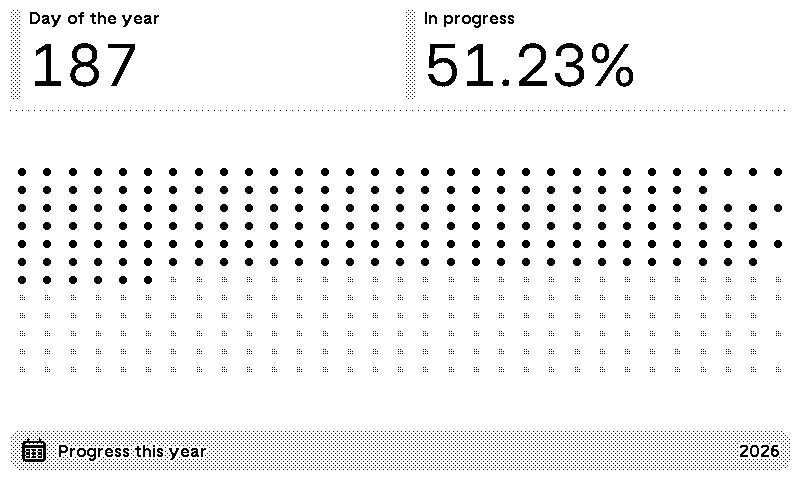
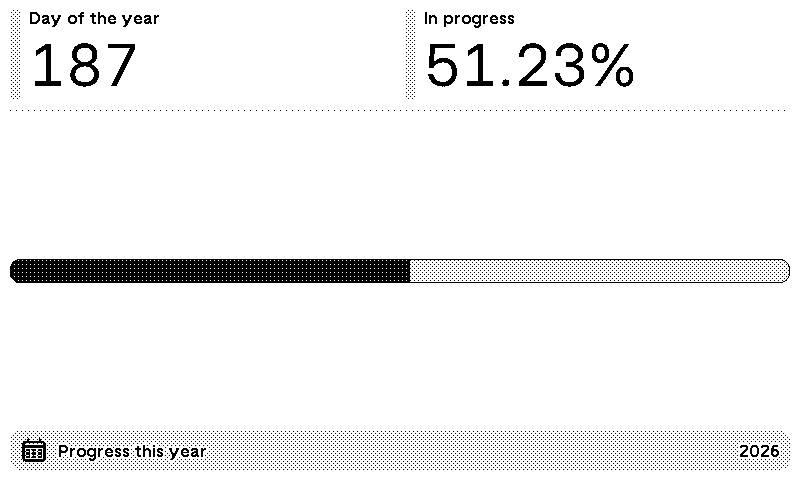
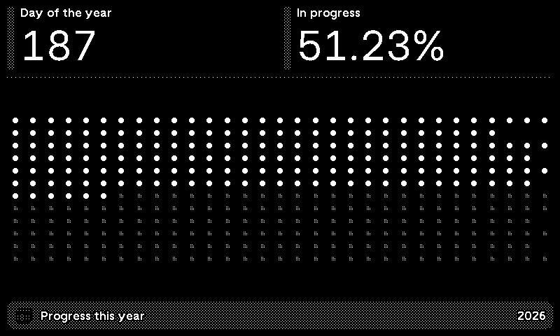
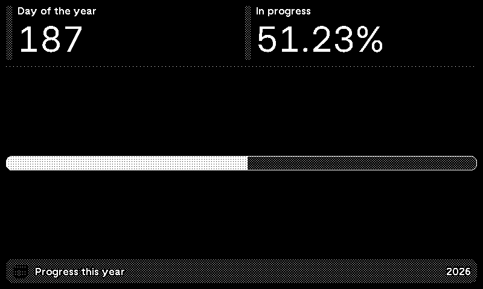

# Year Progress

Track how far you are through the year on a [TRMNL](https://usetrmnl.com/) device — as a progress bar or a dot calendar (one dot per day, one row per month).


*Dots (light)*


*Bar (light)*


*Dots (dark)*


*Bar (dark)*

## Features

- **Bar** or **Dots** — choose in plugin settings
- **Full**, **Half horizontal**, **Half vertical**, and **Quadrant** mashups
- Compact dot layout on smaller views (quadrant, half horizontal)
- **Static** plugin — no API, no account data; uses TRMNL date & timezone
- Refreshes once per day

## Install

### Recommended — TRMNL Recipe (one click)

<!-- Replace YOUR_RECIPE_ID with the ID from trmnl.com/recipes after publication -->
**[Install Year Progress on TRMNL →](https://trmnl.com/recipes/YOUR_RECIPE_ID)**

1. Click **Install**
2. Choose **Bar** or **Dots** under **Appearence**
3. Add the plugin to your playlist

Installed recipes receive automatic updates when the author pushes changes. The plugin icon is included with the Recipe install (not with ZIP import).

### Alternative — Import ZIP

For manual install (generic plugin icon):

1. Export from TRMNL (**Export** on plugin settings) or build a flat ZIP (see [Project structure](#project-structure))
2. Open [Private Plugin settings](https://usetrmnl.com/plugin_settings?keyname=private_plugin) → **Import new**
3. Choose **Bar** or **Dots** → Save → add to playlist

### Developers — Clone this repo

```sh
git clone https://github.com/monsieurm/trmnl-yearinprogress.git
cd trmnl-yearinprogress
./bin/trmnlp login
./bin/trmnlp pull    # link an existing plugin (adds id to src/settings.yml)
./bin/trmnlp push    # upload changes to TRMNL
```

## Local development

Uses [trmnlp](https://github.com/usetrmnl/trmnlp). **Docker** or Ruby ≥ 3.4 (`gem install trmnl_preview`).

```sh
./bin/trmnlp serve   # http://localhost:4567
./bin/trmnlp lint    # second terminal; works while serve is running
./bin/trmnlp push    # deploy to TRMNL
```

Preview **Bar** vs **Dots** locally in `.trmnlp.yml` → `custom_fields.appearence`.

### CI (optional)

On push to `main`, GitHub Actions runs `trmnlp lint` and `trmnlp push`. Add repository secret `TRMNL_API_KEY` (TRMNL account API key).

## Project structure

```
.
├── .github/workflows/trmnl.yml
├── bin/trmnlp
└── src/
    ├── settings.yml
    ├── shared.liquid      # layout, CSS, JS (prepended to every view)
    ├── full.liquid
    ├── half_horizontal.liquid
    ├── half_vertical.liquid
    └── quadrant.liquid
```

## Publish to the TRMNL store (Recipe)

1. **Push** latest code: `./bin/trmnlp push`
2. **Icon** — upload in TRMNL plugin settings
3. **Preview** — Force Refresh with **Bar** and **Dots** (Recipe thumbnail uses latest render)
4. **Custom fields** — `author_bio` is required for Recipe submission (included in `settings.yml`)
5. **Publish** — plugin settings → **Publish plugin?**
   - **Unlisted** first to test the install link
   - **Public** for listing on [trmnl.com/recipes](https://trmnl.com/recipes)
6. Update the Recipe install link in this README

Users who **Install** receive updates automatically; **Fork** creates an independent copy.

## License

MIT
